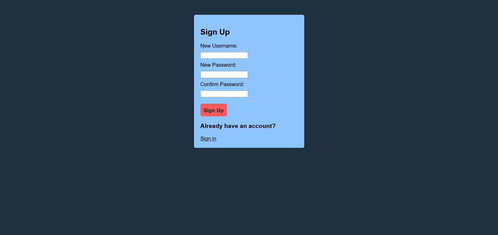
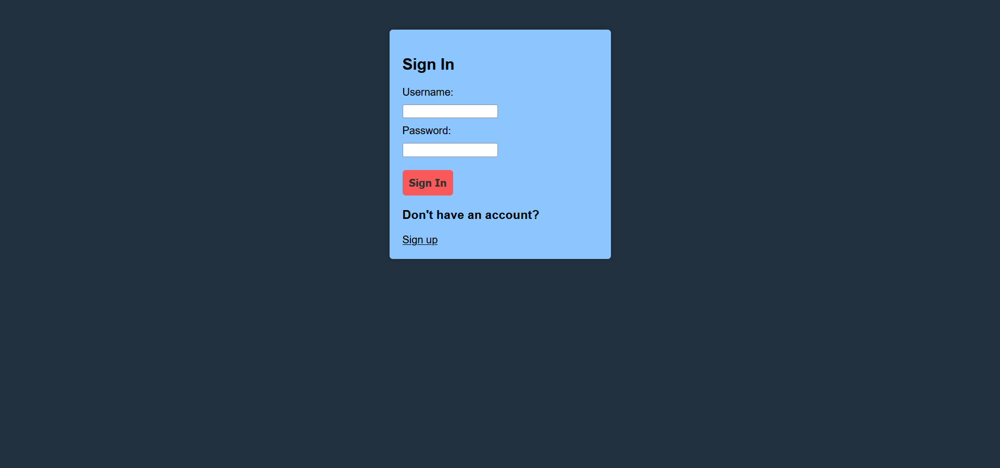

# Winter 2023 CSCI 2020U Systems Project Group 8

## Developers:
* #### David Houle-Tymeczko
* #### Sheida Ebrahimi Siaghi 
* #### Siddhant Das
* #### Adam Orfao

## Requirements
* #### Intellij IDEA
* #### GlassFish 7.0.0

## How to run

1. Clone this repository on your device
2. Open the repository using Intellij
3. On the top right menu, click on 'Configurations' and then 'Edit configurations'
4. Click on 'Add configuration' then select Glassfish with a local server
5. Add 'domain1' on the 'Server Domain' box
6. On the Deployment tab click on the plus sign and add 'webboards: war exploded'
7. Click 'OK' and then click on the green arrow to run the server
8. An HTML webpage will be loaded on your browser with the URL: <http://localhost:8080/webboards-1.0-SNAPSHOT/>

## How to use

